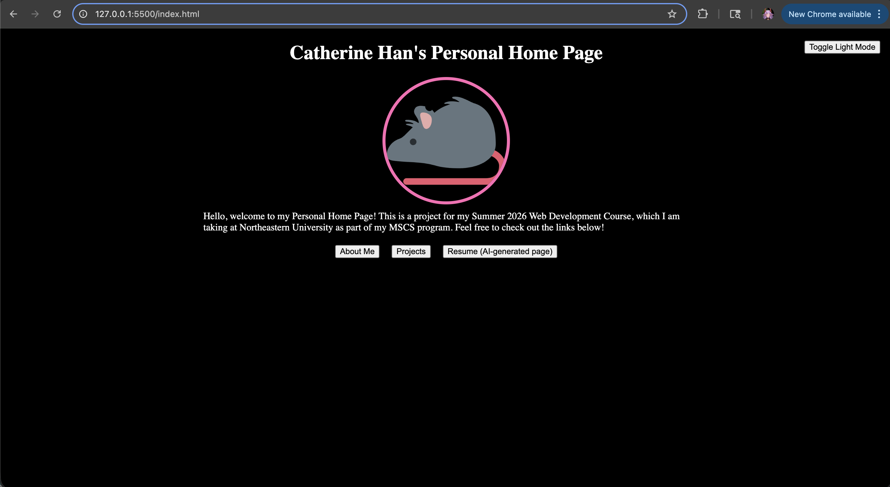

## Author

Catherine Han

## Class Link

https://northeastern.instructure.com/courses/249954

## Project Objective

In this assignment we will be implementing a homepage using vanilla HTML5, CSS3 and ES6+. This is a front-end only static page, so we will not use a backend or any components libraries. We will not use jQuery, and all JS code is in ES6 modules.

I have also provided a creative addition to my page, something that will differentiate it from every other page. It is implemented using ES6+, and HTML+CSS. My creative addition is: a dark mode toggle, which persists the user's choice to the browser's Local Storage API!

You can also find a short narrated video demonstrating the application here: https://www.youtube.com/watch?v=UYESPfArwh8

## Screenshot

## Instructions to build

1. npm i
2. boot up a live server, such as VSCode Live Server extension
3. visit the site at: http://127.0.0.1:5500/index.html

## AI Tool Usage

# Describe the use of GenAI tools if any. Provide what models were used, versions, prompts, and how it was used. Add this as a section in your readme

I used AI (ChatGPT 5.5) in two places:

1. to create the AI-generated resume page, as required by the rubric statement: "Does it include at least 2 html pages with different URLs, and a third AI generated page". my prompt was: "given the below pasted copy of my linkedin page, generate html and css for a resume page."
2. to learn how to install prettier. my prompt was: "give me steps on installing prettier for a vanilla html/css/js project".
